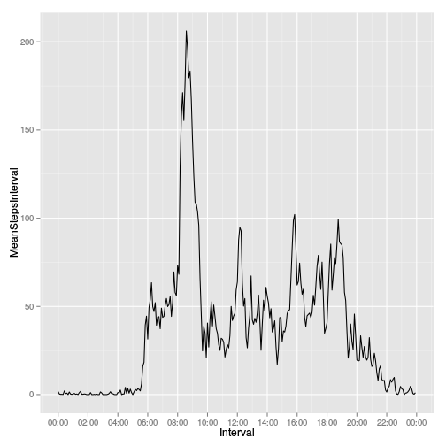
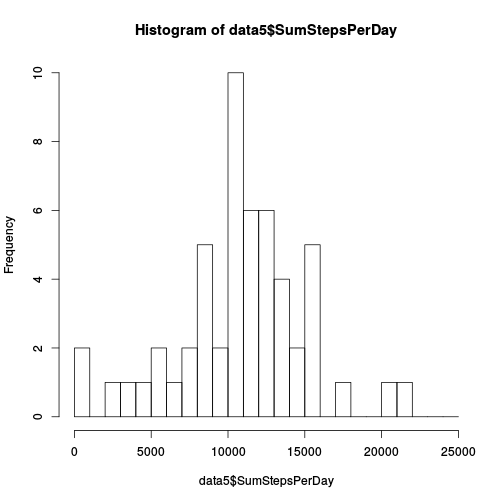
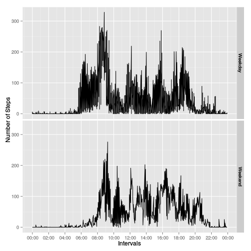

# Peer Assignment 1
Toni Massó  
10/05/2015  


```r
library(dplyr)
```

```
## 
## Attaching package: 'dplyr'
## 
## The following object is masked from 'package:stats':
## 
##     filter
## 
## The following objects are masked from 'package:base':
## 
##     intersect, setdiff, setequal, union
```

```r
library(ggplot2)
library(scales)
```
###Loading and preprocessing the data


```r
data1<-read.csv('data/activity.csv')
data1$interval <- sapply(data1$interval,FUN=function (i) {  sprintf("%02d:%02d", i %/% 100, i %% 100)})
data1$date2<-paste(data1$date,data1$interval)
data1$date2<-as.POSIXlt(data1$date2,'%Y-%m-%d %H:%M')
data0<-data1
```

###What is mean total number of steps taken per day?


```r
data1<- na.omit(data1)
data2<-aggregate(data1$steps,by=list(Date=data1$date),FUN=sum)
colnames(data2)<- c('Date', 'SumStepsPerDay')
hist(data2$SumStepsPerDay,breaks=seq(0,25000,by=1000))
```

 

####Mean per day:

```r
dataMean<-aggregate(data1$steps,by=list(Date=data1$date),FUN=mean)
dataMean
```

```
##          Date          x
## 1  2012-10-02  0.4375000
## 2  2012-10-03 39.4166667
## 3  2012-10-04 42.0694444
## 4  2012-10-05 46.1597222
## 5  2012-10-06 53.5416667
## 6  2012-10-07 38.2465278
## 7  2012-10-09 44.4826389
## 8  2012-10-10 34.3750000
## 9  2012-10-11 35.7777778
## 10 2012-10-12 60.3541667
## 11 2012-10-13 43.1458333
## 12 2012-10-14 52.4236111
## 13 2012-10-15 35.2048611
## 14 2012-10-16 52.3750000
## 15 2012-10-17 46.7083333
## 16 2012-10-18 34.9166667
## 17 2012-10-19 41.0729167
## 18 2012-10-20 36.0937500
## 19 2012-10-21 30.6284722
## 20 2012-10-22 46.7361111
## 21 2012-10-23 30.9652778
## 22 2012-10-24 29.0104167
## 23 2012-10-25  8.6527778
## 24 2012-10-26 23.5347222
## 25 2012-10-27 35.1354167
## 26 2012-10-28 39.7847222
## 27 2012-10-29 17.4236111
## 28 2012-10-30 34.0937500
## 29 2012-10-31 53.5208333
## 30 2012-11-02 36.8055556
## 31 2012-11-03 36.7048611
## 32 2012-11-05 36.2465278
## 33 2012-11-06 28.9375000
## 34 2012-11-07 44.7326389
## 35 2012-11-08 11.1770833
## 36 2012-11-11 43.7777778
## 37 2012-11-12 37.3784722
## 38 2012-11-13 25.4722222
## 39 2012-11-15  0.1423611
## 40 2012-11-16 18.8923611
## 41 2012-11-17 49.7881944
## 42 2012-11-18 52.4652778
## 43 2012-11-19 30.6979167
## 44 2012-11-20 15.5277778
## 45 2012-11-21 44.3993056
## 46 2012-11-22 70.9270833
## 47 2012-11-23 73.5902778
## 48 2012-11-24 50.2708333
## 49 2012-11-25 41.0902778
## 50 2012-11-26 38.7569444
## 51 2012-11-27 47.3819444
## 52 2012-11-28 35.3576389
## 53 2012-11-29 24.4687500
```

####Median per day:

```r
dataMedian<-aggregate(data1$steps,by=list(Date=data1$date),FUN=median)
dataMedian
```

```
##          Date x
## 1  2012-10-02 0
## 2  2012-10-03 0
## 3  2012-10-04 0
## 4  2012-10-05 0
## 5  2012-10-06 0
## 6  2012-10-07 0
## 7  2012-10-09 0
## 8  2012-10-10 0
## 9  2012-10-11 0
## 10 2012-10-12 0
## 11 2012-10-13 0
## 12 2012-10-14 0
## 13 2012-10-15 0
## 14 2012-10-16 0
## 15 2012-10-17 0
## 16 2012-10-18 0
## 17 2012-10-19 0
## 18 2012-10-20 0
## 19 2012-10-21 0
## 20 2012-10-22 0
## 21 2012-10-23 0
## 22 2012-10-24 0
## 23 2012-10-25 0
## 24 2012-10-26 0
## 25 2012-10-27 0
## 26 2012-10-28 0
## 27 2012-10-29 0
## 28 2012-10-30 0
## 29 2012-10-31 0
## 30 2012-11-02 0
## 31 2012-11-03 0
## 32 2012-11-05 0
## 33 2012-11-06 0
## 34 2012-11-07 0
## 35 2012-11-08 0
## 36 2012-11-11 0
## 37 2012-11-12 0
## 38 2012-11-13 0
## 39 2012-11-15 0
## 40 2012-11-16 0
## 41 2012-11-17 0
## 42 2012-11-18 0
## 43 2012-11-19 0
## 44 2012-11-20 0
## 45 2012-11-21 0
## 46 2012-11-22 0
## 47 2012-11-23 0
## 48 2012-11-24 0
## 49 2012-11-25 0
## 50 2012-11-26 0
## 51 2012-11-27 0
## 52 2012-11-28 0
## 53 2012-11-29 0
```

###What is the average daily activity pattern?

```r
data3<-aggregate(data1$steps,by=list(Interval=data1$interval),FUN=mean,na.rm=TRUE)
colnames(data3)<- c('Interval','MeanStepsInterval')
data3$Interval<-strptime(data3$Interval,format='%H:%M')
ggplot( data = data3, aes(Interval,MeanStepsInterval)) + geom_line() + scale_x_datetime( breaks=("120 min"),labels=date_format("%H:%M"))
```

 

####Max Interval 

```r
data3[data3$MeanStepsInterval== max(data3$MeanStepsInterval),]
```

```
##                Interval MeanStepsInterval
## 104 2015-05-15 08:35:00          206.1698
```

###Imputing Missing Values

```r
sumNASteps<-sum(is.na(data0$steps))
sumNADate<-sum(is.na(data0$date))
sumNAInterval<-sum(is.na(data0$interval))
```
####NAs in Steps field

```r
sumNASteps
```

```
## [1] 2304
```
####NAs in Date field

```r
sumNADate
```

```
## [1] 0
```
####NAs in Interval field

```r
sumNAInterval
```

```
## [1] 0
```
####Filling NA values

I fill NA values with Median value of the interval.


```r
data4<-data1
for(i in 1:length(data4$steps)){
        if(is.na(data4$steps[i])){
                data4$steps[i]<-data3$MeanStepsInterval[substring(as.character(data3$Interval),12,16)==data4$interval[i]]
        }
}
data5<-aggregate(data4$steps,by=list(Date=data4$date),FUN=sum)
colnames(data5)<- c('Date', 'SumStepsPerDay')
hist(data5$SumStepsPerDay,breaks=seq(0,25000,by=1000))
```

 

####Mean per day withou NA:

```r
dataMean<-aggregate(data4$steps,by=list(Date=data4$date),FUN=mean)
dataMean
```

```
##          Date          x
## 1  2012-10-02  0.4375000
## 2  2012-10-03 39.4166667
## 3  2012-10-04 42.0694444
## 4  2012-10-05 46.1597222
## 5  2012-10-06 53.5416667
## 6  2012-10-07 38.2465278
## 7  2012-10-09 44.4826389
## 8  2012-10-10 34.3750000
## 9  2012-10-11 35.7777778
## 10 2012-10-12 60.3541667
## 11 2012-10-13 43.1458333
## 12 2012-10-14 52.4236111
## 13 2012-10-15 35.2048611
## 14 2012-10-16 52.3750000
## 15 2012-10-17 46.7083333
## 16 2012-10-18 34.9166667
## 17 2012-10-19 41.0729167
## 18 2012-10-20 36.0937500
## 19 2012-10-21 30.6284722
## 20 2012-10-22 46.7361111
## 21 2012-10-23 30.9652778
## 22 2012-10-24 29.0104167
## 23 2012-10-25  8.6527778
## 24 2012-10-26 23.5347222
## 25 2012-10-27 35.1354167
## 26 2012-10-28 39.7847222
## 27 2012-10-29 17.4236111
## 28 2012-10-30 34.0937500
## 29 2012-10-31 53.5208333
## 30 2012-11-02 36.8055556
## 31 2012-11-03 36.7048611
## 32 2012-11-05 36.2465278
## 33 2012-11-06 28.9375000
## 34 2012-11-07 44.7326389
## 35 2012-11-08 11.1770833
## 36 2012-11-11 43.7777778
## 37 2012-11-12 37.3784722
## 38 2012-11-13 25.4722222
## 39 2012-11-15  0.1423611
## 40 2012-11-16 18.8923611
## 41 2012-11-17 49.7881944
## 42 2012-11-18 52.4652778
## 43 2012-11-19 30.6979167
## 44 2012-11-20 15.5277778
## 45 2012-11-21 44.3993056
## 46 2012-11-22 70.9270833
## 47 2012-11-23 73.5902778
## 48 2012-11-24 50.2708333
## 49 2012-11-25 41.0902778
## 50 2012-11-26 38.7569444
## 51 2012-11-27 47.3819444
## 52 2012-11-28 35.3576389
## 53 2012-11-29 24.4687500
```

####Median per day withou NA:

```r
dataMedian<-aggregate(data4$steps,by=list(Date=data4$date),FUN=median)
dataMedian
```

```
##          Date x
## 1  2012-10-02 0
## 2  2012-10-03 0
## 3  2012-10-04 0
## 4  2012-10-05 0
## 5  2012-10-06 0
## 6  2012-10-07 0
## 7  2012-10-09 0
## 8  2012-10-10 0
## 9  2012-10-11 0
## 10 2012-10-12 0
## 11 2012-10-13 0
## 12 2012-10-14 0
## 13 2012-10-15 0
## 14 2012-10-16 0
## 15 2012-10-17 0
## 16 2012-10-18 0
## 17 2012-10-19 0
## 18 2012-10-20 0
## 19 2012-10-21 0
## 20 2012-10-22 0
## 21 2012-10-23 0
## 22 2012-10-24 0
## 23 2012-10-25 0
## 24 2012-10-26 0
## 25 2012-10-27 0
## 26 2012-10-28 0
## 27 2012-10-29 0
## 28 2012-10-30 0
## 29 2012-10-31 0
## 30 2012-11-02 0
## 31 2012-11-03 0
## 32 2012-11-05 0
## 33 2012-11-06 0
## 34 2012-11-07 0
## 35 2012-11-08 0
## 36 2012-11-11 0
## 37 2012-11-12 0
## 38 2012-11-13 0
## 39 2012-11-15 0
## 40 2012-11-16 0
## 41 2012-11-17 0
## 42 2012-11-18 0
## 43 2012-11-19 0
## 44 2012-11-20 0
## 45 2012-11-21 0
## 46 2012-11-22 0
## 47 2012-11-23 0
## 48 2012-11-24 0
## 49 2012-11-25 0
## 50 2012-11-26 0
## 51 2012-11-27 0
## 52 2012-11-28 0
## 53 2012-11-29 0
```
###Are there differences in activity patterns between weekdays and weekends?:

```r
Sys.setlocale("LC_TIME", "en_US.UTF-8")
```

```
## [1] "en_US.UTF-8"
```

```r
data1$weekday<-weekdays(data1$date2)
dataWeek<-aggregate(data1$steps,by=list(Weekday=data1$weekday,Intervals=data1$interval),FUN=mean,na.rm=TRUE)
dataWeek$Intervals<-strptime(dataWeek$Intervals,format='%H:%M')
dataWeek$day<-'Weekday'
dataWeek[dataWeek$Weekday=='Saturday'| dataWeek$Weekday=='Sunday','day']<-'Weekend'
p<-ggplot( data = dataWeek, aes(Intervals,x)) + geom_line() + scale_x_datetime( breaks=("120 min"),labels=date_format("%H:%M")) + scale_y_continuous(name="Number of Steps")
p + facet_grid(day ~ .)
```

 


